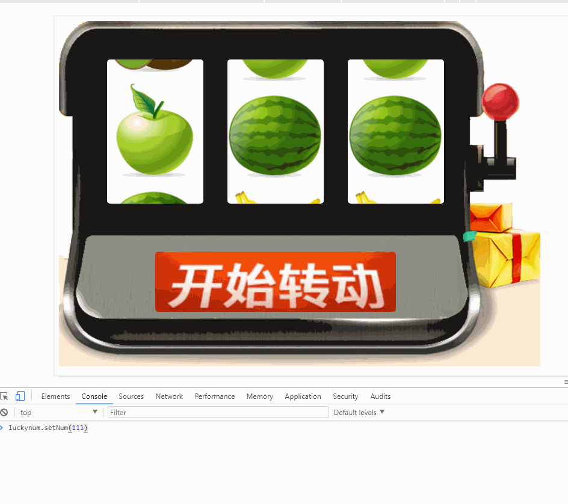

# 老虎机抽奖组件
点击开始转动后，通过setNum(num)可以停在对应的位置[演示地址](http://119.29.248.12:8080/Luckynum/index.html)

## 使用方法
引入css
```html
<link href="css/style.css" rel="stylesheet" type="text/css">
```

## 使用示例
```js

import{ Luckynum } from '../js/Luckynum'

//配置传入参数
let obj={};
obj.dom=document.getElementById('app');
obj.img={
    width:'160px',//转盘宽度
    left:['80px','280px','480px'],//3个转盘对应的位置
    top:'8%',//转盘与顶部的距离
    url:['/static/imgs/1.png','/static/imgs/2.png','/static/imgs/3.png','/static/imgs/4.png','/static/imgs/5.png','/static/imgs/6.png'],//抽奖显示图片
};
//按钮的大小，位置和背景图
obj.btn={
    url:'/static/imgs/btn.png',
    width:'400px',
    height:'100px',
    top:'48%',
    left:'20%'
};
//开始钩子
obj.startHook=()=>{
    console.log('startHook')
};
//结束钩子，res为抽奖结果
obj.endHook=(res)=>{
    console.log(res);
};
//整个抽奖组件的大小和背景图
obj.width='800px';
obj.height='800px';
obj.backgroudImg='/static/imgs/mac.png';
let luckynum=new Luckynum(obj);

//绑定到window方便演示
window.luckynum=luckynum;
```
## Luckynum类说明

```js
constructor(config){} //构造函数,需要传入一个参数对象
radomStart(){} //获得一个随机的初始状态
setNum(num){} //设置获奖数字，可从服务端获取
addHtml(){} //初始化dom
getTopArr(){} //计算结束的位置
startRun(){} //开始转动
runUp(index){} //根据传入的index转动对应的img
runfun(img,index){} //控制循环的函数，当3个img都停下来就重置
run(img,index){} //循环函数，每次转动的速度为speed[index]
isNow(index){} //判断当前是否应该停下,return true/false
reSet(){} //重置所有参数
startHook(){} //默认开始钩子
endHook(){} //默认结束钩子
 
```